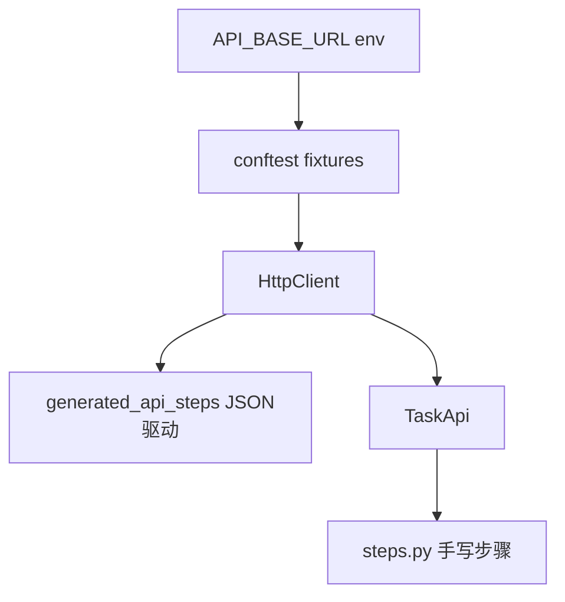

# BDD API 四项落地实施计划

## 范围确认

基于你的选择，计划在仓库内实现以下四块（**执行阶段**再改代码；本文档为实施规格）。

---

## 1. 封装 `HttpClient`

**路径**：`[bdd_project/core/client.py](bdd_project/core/client.py)`（新建 `bdd_project/core/__init__.py` 按需导出）。

**行为**：

- 内部 `requests.Session()`，在 `__init__(self, base_url: str)` 中保存并规范化 `base_url`（无尾部 `/` 或与现有拼接逻辑一致）。
- 提供 `get/post/put/delete(self, path: str, **kwargs)`：`path` 为以 `/` 开头的相对路径，与 fixture JSON 中 `path` 字段一致；完整 URL = `base_url + path`（与当前 `api_base_url.rstrip("/") + path` 行为一致）。
- 不在此类内吞异常；响应对象直接返回，便于 Step 中断言。

**接入**：

- `[bdd_project/steps/api/conftest.py](bdd_project/steps/api/conftest.py)`：新增或替换 fixture，例如 `http_client` / `api_client`（名称二选一，建议 `**http_client` 返回 `HttpClient`**，避免与「裸 Session」混淆；若保留名 `api_client` 则文档说明类型已变）。
- `[bdd_project/steps/api/generated_api_steps.py](bdd_project/steps/api/generated_api_steps.py)`：`api_send_request` 改为只注入 `HttpClient`，**删除**对 `api_base_url` + 裸 `Session` 的拼接与调用；按 `method` 调用 `client.get/post/put/delete(path, ...)`。
- 同步修改生成器模板：`[/.claude/skills/api-steps-to-bdd-project/scripts/api_steps_to_bdd_project.py](.claude/skills/api-steps-to-bdd-project/scripts/api_steps_to_bdd_project.py)` 中与上述相同的片段，保证下次 `api_steps_to_bdd_project.py` 生成结果一致。

**兼容性**：对外 Gherkin 与 JSON fixture 不变；仅 Python 层依赖类型与 fixture 参数列表变化。

---

## 2. 显式 `TaskApi` 与 fixture 注入

**路径**：`[bdd_project/api/task_api.py](bdd_project/api/task_api.py)`（新建 `bdd_project/api/__init__.py`）。

**行为**：

- `class TaskApi`：`__init__(self, client: HttpClient)`。
- 为当前 `[task_api.json](bdd_project/fixtures/api_steps/task_api.json)` 中涉及的任务接口提供方法（与 `path`/`method` 一致），例如：`create_task`、`list_tasks`、`update_task`、删除/恢复等（以 JSON 中实际步骤为准，方法名用英文小写+下划线）。
- 方法体仅组装 `json=` / 无 body 等并 `return self.client.post("/api/tasks/create", json=...)` 等，**不**在此写 BDD 断言。

**conftest**：

- 在 `[bdd_project/steps/api/conftest.py](bdd_project/steps/api/conftest.py)` 增加 `@pytest.fixture def task_api(http_client): return TaskApi(http_client)`（依赖项名与上一节 HttpClient fixture 一致）。

**与 JSON 步骤并存**：

- **不删除** `generated_api_steps` 与现有 Scenario。
- 新场景或 `[bdd_project/steps/api/steps.py](bdd_project/steps/api/steps.py)` 中手写步骤可注入 `task_api` + `context`（见第 4 节命名）；与数据驱动步骤互不覆盖。

---

## 3. 配置化 `API_BASE_URL`

**实现**：

- `[bdd_project/steps/api/conftest.py](bdd_project/steps/api/conftest.py)` 中提供 base URL 的单一来源，例如：
  - `os.environ.get("API_BASE_URL", "http://localhost:8765")`（或从 `os.getenv` 读取）。
- `HttpClient` 的构造使用该值（由 fixture 传入）。

**pytest 配置**：

- 在仓库根 `[pyproject.toml](pyproject.toml)` 的 `[tool.pytest.ini_options]` **或** 新增/沿用 `[bdd_project/pytest.ini](bdd_project/pytest.ini)`（若项目习惯单独文件）中增加**注释说明**或文档性条目：CI/本地通过环境变量 `API_BASE_URL` 覆盖默认值。
- 不在此引入新依赖（如 `pytest-env`）除非已有；优先 **环境变量 + conftest 默认值**。

**文档**：若 `[CLAUDE.md](CLAUDE.md)` 或技能文档需要一行说明 API 测试 base URL，可仅追加环境变量名与默认值（执行阶段按需最小增补）。

---

## 4. 命名统一：`context` 替代 `api_ctx`

**决策**：采用 **全量重命名** `api_ctx` → `context`（避免长期维护别名双轨）。

**原因**：当前仓库中 `api_ctx` 仅出现在：

- `[bdd_project/steps/api/generated_api_steps.py](bdd_project/steps/api/generated_api_steps.py)`
- `[.claude/skills/api-steps-to-bdd-project/scripts/api_steps_to_bdd_project.py](.claude/skills/api-steps-to-bdd-project/scripts/api_steps_to_bdd_project.py)` 内嵌模板

影响面可控；生成器与现文件同步后，后续再生成的脚手架也统一为 `context`。

**注意**：pytest-bdd 中 `context` 作为 fixture 名常见；若与某步骤参数名冲突，以实际报错为准（当前步骤签名为 `step_label` 等，冲突风险低）。

**可选**：在 `[/.claude/skills/api-steps-to-bdd-project/SKILL.md](.claude/skills/api-steps-to-bdd-project/SKILL.md)` 若出现「跨 step 状态」描述，可补一句「fixture 名为 `context`」。

---

## 5. 验证（执行阶段）

- 使用项目 venv：`[./.venv/Scripts/python -m pytest bdd_project/tests/test_api.py -v](bdd_project/tests/test_api.py)`（或单用例）。
- 若有针对 `api_steps_to_bdd_project` 的测试，再生跑一次生成脚本对比 diff（若存在）。

---

## 依赖关系小结

---

## 实施待办（执行用）

| ID           | 内容                                                    |
| ------------ | ----------------------------------------------------- |
| http-client  | 新增 `bdd_project/core/client.py` + `HttpClient`        |
| conftest-url | conftest：env 读取 base URL；fixture 提供 `HttpClient`      |
| gen-steps    | 更新 `generated_api_steps.py`：`HttpClient` + `context`  |
| generator    | 同步 `api_steps_to_bdd_project.py` 模板                   |
| task-api     | 新增 `bdd_project/api/task_api.py` + `task_api` fixture |
| docs-skill   | 必要时 SKILL/注释中补充 `API_BASE_URL` 与 `context`            |
| test         | 跑 `test_api.py` 通过                                    |

