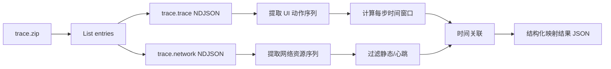

# Playwright trace.zip：UI 操作与接口请求映射方案

## 现状

- 录制入口：[demo/trace_click_api/recordings/task.py](demo/trace_click_api/recordings/task.py) 将 trace 写入 `demo/trace_click_api/traces/task_trace.zip`（目录已在 [.gitignore](.gitignore) 忽略）。
- 本地验证服务：[demo/trace_click_api/server.py](demo/trace_click_api/server.py) 提供与「新增/编辑/删除」按钮对应的 POST JSON 接口，便于在 trace 中出现可解释的 XHR/fetch。
- 项目依赖已含 `playwright>=1.58.0`（[pyproject.toml](pyproject.toml)），无需为解析 zip/JSON 增加重型依赖。

**结论**：解析逻辑可先用 **demo 内脚本 + 一条 pytest/快照测试** 验证；若后续要在 BDD 流水线中复用，再抽到 `bdd_project` 下作为子模块并纳入 `setuptools` 包列表。

---

## 数据流（实现时对齐）



---

## 1. 解压与健壮性

- 使用标准库 `zipfile` 打开；**不要硬编码**根目录名，先 `namelist()`，再定位 `*.trace` 与 `*.network`（常见为 `trace.trace` / `trace.network`，版本差异时可能不同前缀）。
- 按行读取 NDJSON（每行一个 JSON），`json.loads` 失败行可记录行号后跳过或计入 diagnostics，避免单行损坏导致全文件失败。

---

## 2. 从 `trace.trace` 提取「UI 操作」

- **目标行**：`type` 为动作相关的事件（用户给出的示例为 `"type": "action"` 且含 `apiName`）。Playwright 内部格式**未在公开文档中完整冻结**，实现时需对本机生成的 `task_trace.zip` 做一次 **字段探测**（打印各 `type` 频次、`action` 样例），再固定过滤规则。
- **建议保留字段**：`apiName`、`params`（含 selector / url 等）、`startTime`/`endTime`、`callId`（若存在，可作调试锚点）。
- **可排除**：纯快照、内部 instrumentation（若大量 `type` 与 UI 无关则按前缀或名单过滤）。

输出结构示例（逻辑模型）：

```text
ActionStep: index, apiName, params, startTime, endTime, raw_ref
```

---

## 3. 从 `trace.network` 提取「接口请求」

- **目标行**：`type` 为资源/网络事件（用户示例为 `"type": "resource"`）。同样以样本文件确认字段名是否一致。
- **建议保留**：`url`, `method`, `status`, `startTime`/`endTime`, `requestBody`/`responseBody`（可能为大文本，输出时可截断或只保留 hash）。
- **静态资源过滤**（可配置）：
  - 按 **资源类型**：若存在 `resourceType`，保留 `fetch` / `xhr`（及必要时 `document` 用于 `page.goto` 场景）。
  - 按 **URL**：排除常见静态扩展名（`.js` / `.css` / `.png` / `.woff` 等）及同源心跳路径（若业务有已知 pattern）。
  - 按 **方法**：可选只保留 `GET/POST/PUT/PATCH/DELETE`。
- **未匹配请求**：单独进入 `orphan_requests` 列表便于调参。

---

## 4. 关联策略：时间窗口 + 前瞻 + 下一操作截断

对排序后的每个 `ActionStep`（按下标 `i`）定义窗口：

- **下界**：`action.startTime`（或 `action.endTime`，二选一需与样本对比哪种与网络起始更吻合；默认从 `startTime` 更贴近「用户发起」）。
- **上界**（推荐组合）：
  - `upper = min(action.endTime + lookahead_ms, next_action.startTime)`（若无 `next_action`，仅用 `endTime + lookahead_ms`）。
- **匹配规则**：对过滤后的每个 network 事件，若 `network.startTime` 落在 `[lower, upper]`（闭区间），则归入该 `ActionStep`；若同一请求落在多个窗口，归**最早仍包含该点的动作**或**窗口起点最近的动作**（需二选一并写死，避免重复计数）。

**参数**：

| 参数                    | 作用                                         |
| --------------------- | ------------------------------------------ |
| `lookahead_ms`        | 吸收点击后异步发起的 XHR（建议默认 500–2000ms，对 demo 可扫参） |
| `use_next_action_cap` | 是否用下一操作开始时间截断，减少「拖到下一步」的误归属                |

**一对多**：同一操作下允许多个 API（列表输出）；**多对一**应避免：通过窗口互斥或「主请求」启发式（仅取第一个 XHR、或仅取与 `method/status` 相关的请求）— 可作为可选后处理。

---

## 5. 输出与可观测性

- **机器可读**：单文件 JSON，包含 `actions[]`（每项带 `matched_requests[]`）、`orphan_requests`、`meta`（`lookahead_ms`、过滤规则、源 zip 路径、解析时间）。
- **人类可读**：可选 Markdown/表格摘要（操作序号、`apiName`、selector 摘要、关联的 method+url+status）。
- **调试**：对争议匹配输出 `reason` 字段（例如 `in_window`、`only_candidate`）。

---

## 6. 版本与兼容性

- **固定 Playwright  minor 版本**于 CI/文档，减少 NDJSON 字段漂移。
- 解析层使用 `TypedDict` / dataclass + `get()` 默认值，对缺失字段降级而非崩溃。

---

## 7. 验证路径（建议）

1. 本地运行 `server.py`，执行 `recordings/task.py` 生成 `task_trace.zip`。
2. 对解压后的 `trace.trace` / `trace.network` 做 **行类型统计 + 各取 3 条样例**。
3. 实现解析 + 关联 CLI（例如 `python -m ... --zip path --lookahead 1000`）。
4. 用已知顺序的 API（`/api/tasks/create`、`update` 等，见 [server.py](demo/trace_click_api/server.py) 路由）断言：**第 N 个关键点击/提交** 对应的请求 URL **子串**出现在该步的 `matched_requests` 中（测试可用仓库内 **小型 fixture zip**，若不便提交大文件则 **生成即测** 或只提交裁剪过的最小 NDJSON 片段作单元测试）。

---

## 8. 工作量与风险

- **最大工作量**：时间窗口与过滤规则的 **扫参调优**（你方表格已概括）；建议先做 **可重复脚本 + 可视化日志**，再收紧默认参数。
- **风险**：内部 trace 格式变更 → 用样本探测 + 可选 `playwright` 版本 pin 缓解。

---

## 建议落地位置（实现阶段任选）

| 方案                | 说明                                                                                                                     |
| ----------------- | ---------------------------------------------------------------------------------------------------------------------- |
| A. Demo 先行        | 在 `demo/trace_click_api/` 下新增 `parse_trace.py`（或包目录），只服务本 demo，迭代最快。                                                   |
| B. 入库 bdd_project | 新建 `bdd_project/trace_mapping/`（或类似名），便于与 BDD 报告集成；需改 [pyproject.toml](pyproject.toml) `packages.find` 或显式 `packages`。 |

若你更希望「仅方案文档」而不落代码，可将上述第 7 节作为验收清单，由实现阶段再选 A/B。
